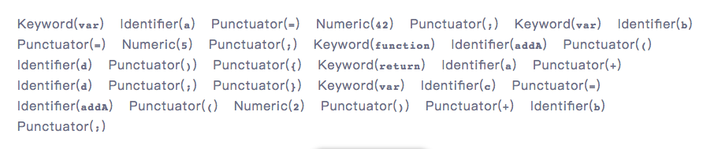
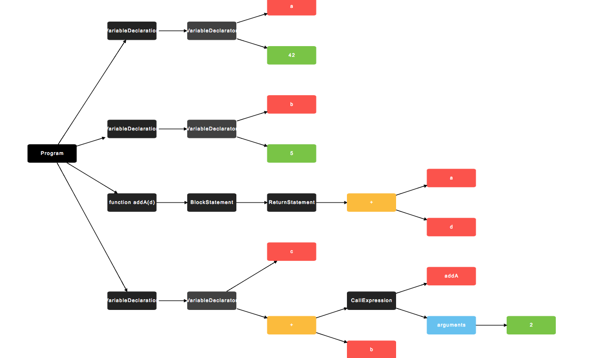

## 前言

Babel为当前最流行的代码JavaScript编译器了，其使用的JavaScript解析器为[babel-parser](https://github.com/babel/babel/tree/master/packages/babel-parser)，最初是从`Acorn` 项目`fork`出来的。Acorn 非常快，易于使用，并且针对非标准特性(以及那些未来的标准特性) 设计了一个基于插件的架构。本文主要介绍[`esprima`](https://github.com/jquery/esprima)解析生成的抽象语法树节点，`esprima`的实现也是基于Acorn的。

## 解析器 Parser

JavaScript Parser 是把js源码转化为抽象语法树（AST）的解析器。这个步骤分为两个阶段：[词法分析（Lexical Analysis）](https://en.wikipedia.org/wiki/Lexical_analysis) 和 [语法分析（Syntactic Analysis）](https://en.wikipedia.org/wiki/Parsing)。

常用的JavaScript Parser：

* [esprima](https://github.com/jquery/esprima)

* [uglifyJS2](https://github.com/mishoo/UglifyJS2)

* [traceur](https://github.com/google/traceur-compiler)

* [acorn](https://github.com/acornjs/acorn)

* [espree](https://github.com/eslint/espree)

* [@babel/parser](https://github.com/babel/babel/tree/master/packages/babel-parser)

### 词法分析

词法分析阶段把字符串形式的代码转换为 令牌（tokens）流。你可以把令牌看作是一个扁平的语法片段数组。

```js
n * n;
```

例如上面`n*n`的词法分析得到结果如下：

```js
[
  { type: { ... }, value: "n", start: 0, end: 1, loc: { ... } },
  { type: { ... }, value: "*", start: 2, end: 3, loc: { ... } },
  { type: { ... }, value: "n", start: 4, end: 5, loc: { ... } },
]
```

每一个 type 有一组属性来描述该令牌：

```ts
{
  type: {
    label: 'name',
    keyword: undefined,
    beforeExpr: false,
    startsExpr: true,
    rightAssociative: false,
    isLoop: false,
    isAssign: false,
    prefix: false,
    postfix: false,
    binop: null,
    updateContext: null
  },
  ...
}
```

和 AST 节点一样它们也有 start，end，loc 属性。

### 语法分析

语法分析就是根据词法分析的结果，也就是令牌tokens，将其转换成AST。

```js
function square(n) {
  return n * n;
}
```

如上面代码，生成的AST结构如下：

```js
{
  type: "FunctionDeclaration",
  id: {
    type: "Identifier",
    name: "square"
  },
  params: [{
    type: "Identifier",
    name: "n"
  }],
  body: {
    type: "BlockStatement",
    body: [{
      type: "ReturnStatement",
      argument: {
        type: "BinaryExpression",
        operator: "*",
        left: {
          type: "Identifier",
          name: "n"
        },
        right: {
          type: "Identifier",
          name: "n"
        }
      }
    }]
  }
}
```

下文将对AST各个类型节点做解释。更多AST生成，入口如下:

* [eslint](https://eslint.org/parser/)

* [AST Explorer](https://astexplorer.net/)

* [esprima](http://esprima.org/demo/parse.html)

结合[可视化工具](http://resources.jointjs.com/demos/javascript-ast)，举个例子

如下代码：

```js
var a = 42;
var b = 5;
function addA(d) {
    return a + d;
}
var c = addA(2) + b;
```

第一步词法分析之后长成如下图所示：



语法分析，生产抽象语法树，生成的抽象语法树如下图所示




## Base

### Node

所有节点类型都实现以下接口：

```ts
interface Node {
  type: string;
  range?: [number, number];
  loc?: SourceLocation;
}
```

该type字段是表示AST变体类型的字符串。该loc字段表示节点的源位置信息。如果解析器没有生成有关节点源位置的信息，则该字段为null;否则它是一个对象，包括一个起始位置（被解析的源区域的第一个字符的位置）和一个结束位置.

```ts
interface SourceLocation {
    start: Position;
    end: Position;
    source?: string | null;
}
```

每个Position对象由一个line数字（1索引）和一个column数字（0索引）组成：

```ts
interface Position {
    line: uint32 >= 1;
    column: uint32 >= 0;
}
```


### Programs

```ts
interface Program <: Node {
    type: "Program";
    sourceType: 'script' | 'module';
    body: StatementListItem[] | ModuleItem[];
}
```

表示一个完整的源代码树。

## Scripts and Modules

源代码数的来源包括两种，一种是script脚本，一种是modules模块

当为script时，body为`StatementListItem`。
当为modules时，body为`ModuleItem`。

类型`StatementListItem`和`ModuleItem`类型如下。

```ts
type StatementListItem = Declaration | Statement;
type ModuleItem = ImportDeclaration | ExportDeclaration | StatementListItem;
```

### ImportDeclaration

import语法，导入模块

```ts
type ImportDeclaration {
    type: 'ImportDeclaration';
    specifiers: ImportSpecifier[];
    source: Literal;
}
```

`ImportSpecifier`类型如下：

```ts
interface ImportSpecifier {
    type: 'ImportSpecifier' | 'ImportDefaultSpecifier' | 'ImportNamespaceSpecifier';
    local: Identifier;
    imported?: Identifier;
}
```

`ImportSpecifier`语法如下：

```js
import { foo } from './foo';
```

`ImportDefaultSpecifier`语法如下：

```js
import foo from './foo';
```

`ImportNamespaceSpecifier`语法如下

```js
import * as foo from './foo';
```

### ExportDeclaration

export类型如下

```ts
type ExportDeclaration = ExportAllDeclaration | ExportDefaultDeclaration | ExportNamedDeclaration;
```

`ExportAllDeclaration`从指定模块中导出

```ts
interface ExportAllDeclaration {
    type: 'ExportAllDeclaration';
    source: Literal;
}
```

语法如下:

```js
export * from './foo';
```

`ExportDefaultDeclaration`导出默认模块

```ts
interface ExportDefaultDeclaration {
    type: 'ExportDefaultDeclaration';
    declaration: Identifier | BindingPattern | ClassDeclaration | Expression | FunctionDeclaration;
}
```

语法如下：

```js
export default 'foo';
```

`ExportNamedDeclaration`导出部分模块

```ts
interface ExportNamedDeclaration {
    type: 'ExportNamedDeclaration';
    declaration: ClassDeclaration | FunctionDeclaration | VariableDeclaration;
    specifiers: ExportSpecifier[];
    source: Literal;
}
```

语法如下：

```js
export const foo = 'foo';
```

## Declarations and Statements 

`declaration`，即声明，类型如下：

```ts
type Declaration = VariableDeclaration | FunctionDeclaration | ClassDeclaration;
```

`statements`，即语句，类型如下：

```ts
type Statement = BlockStatement | BreakStatement | ContinueStatement |
    DebuggerStatement | DoWhileStatement | EmptyStatement |
    ExpressionStatement | ForStatement | ForInStatement |
    ForOfStatement | FunctionDeclaration | IfStatement |
    LabeledStatement | ReturnStatement | SwitchStatement |
    ThrowStatement | TryStatement | VariableDeclaration |
    WhileStatement | WithStatement;
```

### VariableDeclarator

变量声明，kind 属性表示是什么类型的声明，因为 ES6 引入了 const/let。

```ts
interface VariableDeclaration <: Declaration {
    type: "VariableDeclaration";
    declarations: [ VariableDeclarator ];
    kind: "var" | "let" | "const";
}
```

### FunctionDeclaration

函数声明（非函数表达式）

```js
interface FunctionDeclaration {
    type: 'FunctionDeclaration';
    id: Identifier | null;
    params: FunctionParameter[];
    body: BlockStatement;
    generator: boolean;
    async: boolean;
    expression: false;
}
```

例如：
```js
function foo() {}
```

### ClassDeclaration

类声明（非类表达式）

```ts
interface ClassDeclaration {
    type: 'ClassDeclaration';
    id: Identifier | null;
    superClass: Identifier | null;
    body: ClassBody;
}
```

`ClassBody`声明如下：

```ts
interface ClassBody {
    type: 'ClassBody';
    body: MethodDefinition[];
}
```

`MethodDefinition`表示方法声明；

```ts
interface MethodDefinition {
    type: 'MethodDefinition';
    key: Expression | null;
    computed: boolean;
    value: FunctionExpression | null;
    kind: 'method' | 'constructor';
    static: boolean;
}
```

```js
class foo {
    constructor() {}
    method() {}
};
```

### ContinueStatement

continue语句

```ts
interface ContinueStatement {
    type: 'ContinueStatement';
    label: Identifier | null;
}
```

例如：

```js
for (var i = 0; i < 10; i++) {
    if (i === 0) {
        continue;
    }
}
```

### DebuggerStatement¶

debugger语句

```ts
interface DebuggerStatement {
    type: 'DebuggerStatement';
}
```

例如

```js
while(true) {
    debugger;
}
```

### DoWhileStatement

do-while语句

```ts
interface DoWhileStatement {
    type: 'DoWhileStatement';
    body: Statement;
    test: Expression;
}
```

`test`表示while条件

例如：

```js
var i = 0;
do {
    i++;
} while(i = 2)
```

### EmptyStatement

空语句

```ts
interface EmptyStatement {
    type: 'EmptyStatement';
}
```

例如：

```js
if(true);

var a = [];
for(i = 0; i < a.length; a[i++] = 0);
```

### ExpressionStatement

表达式语句，即，由单个表达式组成的语句。

```ts
interface ExpressionStatement {
    type: 'ExpressionStatement';
    expression: Expression;
    directive?: string;
}
```

当表达式语句表示一个指令(例如“use strict”)时，directive属性将包含该指令字符串。

例如：

```js
(function(){});
```

### ForStatement

for语句

```ts
interface ForStatement {
    type: 'ForStatement';
    init: Expression | VariableDeclaration | null;
    test: Expression | null;
    update: Expression | null;
    body: Statement;
}
```

### ForInStatement

for...in语句 

```ts
interface ForInStatement {
    type: 'ForInStatement';
    left: Expression;
    right: Expression;
    body: Statement;
    each: false;
}
```

### ForOfStatement

for...of语句

```ts
interface ForOfStatement {
    type: 'ForOfStatement';
    left: Expression;
    right: Expression;
    body: Statement;
}
```

### IfStatement

if 语句

```ts
interface IfStatement {
    type: 'IfStatement';
    test: Expression;
    consequent: Statement;
    alternate?: Statement;
}
```

`consequent`表示if命中后内容，`alternate`表示else或者else if的内容。

### LabeledStatement

label语句，多用于精确的使用嵌套循环中的continue和break。

```ts
interface LabeledStatement {
    type: 'LabeledStatement';
    label: Identifier;
    body: Statement;
}
```

如：

```js
var num = 0;
outPoint:
for (var i = 0 ; i < 10 ; i++){
        for (var j = 0 ; j < 10 ; j++){
            if( i == 5 && j == 5 ){
                break outPoint;
            }
            num++;
        }
}
```

### ReturnStatement

return 语句

```ts
interface ReturnStatement {
    type: 'ReturnStatement';
    argument: Expression | null;
}
```

### SwitchStatement

Switch语句

```ts
interface SwitchStatement {
    type: 'SwitchStatement';
    discriminant: Expression;
    cases: SwitchCase[];
}
```

`discriminant`表示switch的变量。

`SwitchCase`类型如下

```ts
interface SwitchCase {
    type: 'SwitchCase';
    test: Expression | null;
    consequent: Statement[];
}
```

### ThrowStatement

throw语句

```ts
interface ThrowStatement {
    type: 'ThrowStatement';
    argument: Expression;
}
```

### TryStatement

try...catch语句

```ts
interface TryStatement {
    type: 'TryStatement';
    block: BlockStatement;
    handler: CatchClause | null;
    finalizer: BlockStatement | null;
}
```

`handler`为catch处理声明内容，`finalizer`为finally内容。

`CatchClaus` 类型如下

```ts
interface CatchClause {
    type: 'CatchClause';
    param: Identifier | BindingPattern;
    body: BlockStatement;
}
```

例如： 

```js
try {
    foo();
} catch (e) {
    console.erroe(e);
} finally {
    bar();
}
```

### WhileStatement

while语句

```ts
interface WhileStatement {
    type: 'WhileStatement';
    test: Expression;
    body: Statement;
}
```

`test`为判定表达式

### 

with语句（指定块语句的作用域的作用域）

```ts
interface WithStatement {
    type: 'WithStatement';
    object: Expression;
    body: Statement;
}
```

如：

```js
var a = {};

with(a) {
    name = 'xiao.ming';
}

console.log(a); // {name: 'xiao.ming'}
```


## Expressions and Patterns

`Expressions`可用类型如下：

```ts
type Expression = ThisExpression | Identifier | Literal |
    ArrayExpression | ObjectExpression | FunctionExpression | ArrowFunctionExpression | ClassExpression |
    TaggedTemplateExpression | MemberExpression | Super | MetaProperty |
    NewExpression | CallExpression | UpdateExpression | AwaitExpression | UnaryExpression |
    BinaryExpression | LogicalExpression | ConditionalExpression |
    YieldExpression | AssignmentExpression | SequenceExpression;
```

`Patterns`可用有两种类型，函数模式和对象模式如下：

```ts
type BindingPattern = ArrayPattern | ObjectPattern;
```

### ThisExpression

`this` 表达式

```ts
interface ThisExpression {
    type: 'ThisExpression';
}
```

### Identifier

标识符，就是我们写 JS 时自定义的名称，如变量名，函数名，属性名，都归为标识符。相应的接口是这样的：

```ts
interface Identifier {
    type: 'Identifier';
    name: string;
}
```

### Literal

字面量，这里不是指 [] 或者 {} 这些，而是本身语义就代表了一个值的字面量，如 1，“hello”, true 这些，还有正则表达式（有一个扩展的 Node 来表示正则表达式），如 /\d?/。

```ts
interface Literal {
    type: 'Literal';
    value: boolean | number | string | RegExp | null;
    raw: string;
    regex?: { pattern: string, flags: string };
}
```

例如：

```js
var a = 1;
var b = 'b';
var c = false;
var d = /\d/;
```

### ArrayExpression

数组表达式

```ts
interface ArrayExpression {
    type: 'ArrayExpression';
    elements: ArrayExpressionElement[];
}
```

例:

```js
[1, 2, 3, 4];
```

### ArrayExpressionElement

数组表达式的节点，类型如下

```ts
type ArrayExpressionElement = Expression | SpreadElement;
```

Expression包含所有表达式，SpreadElement为扩展运算符语法。

### SpreadElement

扩展运算符

```ts
interface SpreadElement {
    type: 'SpreadElement';
    argument: Expression;
}
```

如： 

```js
var a = [3, 4];
var b = [1, 2, ...a];

var c = {foo: 1};
var b = {bar: 2, ...c};
```

### ObjectExpression

对象表达式

```ts
interface ObjectExpression {
    type: 'ObjectExpression';
    properties: Property[];
}
```

`Property`代表为对象的属性描述

类型如下

```ts
interface Property {
    type: 'Property';
    key: Expression;
    computed: boolean;
    value: Expression | null;
    kind: 'get' | 'set' | 'init';
    method: false;
    shorthand: boolean;
}
```

`kind`用来表示是普通的初始化，或者是 get/set。

例如：

```js
var obj = {
    foo: 'foo',
    bar: function() {},
    noop() {}, // method 为 true
    ['computed']: 'computed'  // computed 为 true
}
```

### FunctionExpression

函数表达式

```ts
interface FunctionExpression {
    type: 'FunctionExpression';
    id: Identifier | null;
    params: FunctionParameter[];
    body: BlockStatement;
    generator: boolean;
    async: boolean;
    expression: boolean;
}
```

例如：

```js
function foo() {}

function *bar() { yield "44"; }

async function noop() { await new Promise(function(resolve, reject) { resolve('55'); }) }
```

### ArrowFunctionExpression

箭头函数表达式

```ts
interface ArrowFunctionExpression {
    type: 'ArrowFunctionExpression';
    id: Identifier | null;
    params: FunctionParameter[];
    body: BlockStatement | Expression;
    generator: boolean;
    async: boolean;
    expression: false;
}
```

`generator`表示是否为generator函数，`async`表示是否为async/await函数，`params`为参数定义。

`FunctionParameter`类型如下

```ts
type FunctionParameter = AssignmentPattern | Identifier | BindingPattern;
```

例：

```js
var foo = () => {};
```

### ClassExpression

类表达式

```ts
interface ClassExpression {
    type: 'ClassExpression';
    id: Identifier | null;
    superClass: Identifier | null;
    body: ClassBody;
}
```

例如：

```js
var foo = class {
    constructor() {}
    method() {}
};
```

### TaggedTemplateExpression

标记模板文字函数

```ts
interface TaggedTemplateExpression {
    type: 'TaggedTemplateExpression';
    readonly tag: Expression;
    readonly quasi: TemplateLiteral;
}
```

`TemplateLiteral`类型如下

```ts
interface TemplateLiteral {
    type: 'TemplateLiteral';
    quasis: TemplateElement[];
    expressions: Expression[];
}
```

`TemplateElement`类型如下

```ts
interface TemplateElement {
    type: 'TemplateElement';
    value: { cooked: string; raw: string };
    tail: boolean;
}
```

例如

```js
var foo = function(a){ console.log(a); }
foo`test`;
```

### MemberExpression

属性成员表达式

```ts
interface MemberExpression {
    type: 'MemberExpression';
    computed: boolean;
    object: Expression;
    property: Expression;
}
```

例如：

```js
const foo = {bar: 'bar'};
foo.bar;
foo['bar']; // computed 为 true
```

### Super

父类关键字

```ts
interface Super {
    type: 'Super';
}
```

例如:

```js
class foo {};
class bar extends foo {
    constructor() {
        super();
    }
}
```

### MetaProperty

（这个不知道干嘛用的）

```ts
interface MetaProperty {
    type: 'MetaProperty';
    meta: Identifier;
    property: Identifier;
}
```

例如:

```js
new.target  // 通过new 声明的对象，new.target会存在

import.meta
```

### CallExpression

函数执行表达式

```ts
interface CallExpression {
    type: 'CallExpression';
    callee: Expression | Import;
    arguments: ArgumentListElement[];
}
```

Import类型，没搞懂。

```ts
interface Import {
    type: 'Import'
}
```

`ArgumentListElement`类型

```ts
type ArgumentListElement = Expression | SpreadElement;
```

如：

```js
var foo = function (){};
foo();
```

### NewExpression

new 表达式

```ts
interface NewExpression {
    type: 'NewExpression';
    callee: Expression;
    arguments: ArgumentListElement[];
}
```

### UpdateExpression

更新操作符表达式，如`++`、`--`;

```ts
interface UpdateExpression {
  type: "UpdateExpression";
  operator: '++' | '--';
  argument: Expression;
  prefix: boolean;
}
```

如:

```js
var i = 0;
i++;
++i; // prefix为true
```

### AwaitExpression

await表达式，会与async连用。

```ts
interface AwaitExpression {
    type: 'AwaitExpression';
    argument: Expression;
}
```

如

```js
async function foo() {
    var bar = function() {
        new Primise(function(resolve, reject) {
            setTimeout(function() {
                resove('foo')
            }, 1000);
        });
    }
    return await bar();
}

foo() // foo
```

### UnaryExpression

一元操作符表达式

```ts
interface UnaryExpression {
  type: "UnaryExpression";
  operator: UnaryOperator;
  prefix: boolean;
  argument: Expression;
}
```

枚举`UnaryOperator`

```ts
enum UnaryOperator {
  "-" | "+" | "!" | "~" | "typeof" | "void" | "delete" | "throw"
}
```

### BinaryExpression

二元操作符表达式

```ts
interface BinaryExpression {
    type: 'BinaryExpression';
    operator: BinaryOperator;
    left: Expression;
    right: Expression;
}
```

枚举`BinaryOperator`

```ts
enum BinaryOperator {
  "==" | "!=" | "===" | "!=="
     | "<" | "<=" | ">" | ">="
     | "<<" | ">>" | ">>>"
     | "+" | "-" | "*" | "/" | "%"
     | "**" | "|" | "^" | "&" | "in"
     | "instanceof"
     | "|>"
}
```

### LogicalExpression

逻辑运算符表达式

```ts
interface LogicalExpression {
    type: 'LogicalExpression';
    operator: '||' | '&&';
    left: Expression;
    right: Expression;
}
```

如：

```js
var a = '-';
var b = a || '-';

if (a && b) {}
```

### ConditionalExpression

条件运算符

```ts
interface ConditionalExpression {
    type: 'ConditionalExpression';
    test: Expression;
    consequent: Expression;
    alternate: Expression;
}
```

例如：

```js
var a = true;
var b = a ? 'consequent' : 'alternate';
```

### YieldExpression

yield表达式

```ts
interface YieldExpression {
    type: 'YieldExpression';
    argument: Expression | null;
    delegate: boolean;
}
```

例如：

```js
function* gen(x) {
  var y = yield x + 2;
  return y;
}
```

### AssignmentExpression

赋值表达式。

```ts
interface AssignmentExpression {
    type: 'AssignmentExpression';
    operator: '=' | '*=' | '**=' | '/=' | '%=' | '+=' | '-=' |
        '<<=' | '>>=' | '>>>=' | '&=' | '^=' | '|=';
    left: Expression;
    right: Expression;
}
```

`operator`属性表示一个赋值运算符，`left`和`right`是赋值运算符左右的表达式。

### SequenceExpression

序列表达式（使用逗号）。

```ts
interface SequenceExpression {
    type: 'SequenceExpression';
    expressions: Expression[];
}
```

```js
var a, b;
a = 1, b = 2
```

### ArrayPattern

数组解析模式

```ts
interface ArrayPattern {
    type: 'ArrayPattern';
    elements: ArrayPatternElement[];
}
```

例：

```js
const [a, b] = [1,3];
```

elements代表数组节点

ArrayPatternElement如下

```js
type ArrayPatternElement = AssignmentPattern | Identifier | BindingPattern | RestElement | null;
```

### AssignmentPattern

默认赋值模式，数组解析、对象解析、函数参数默认值使用。

```ts
interface AssignmentPattern {
    type: 'AssignmentPattern';
    left: Identifier | BindingPattern;
    right: Expression;
}
```

例：

```js
const [a, b = 4] = [1,3];
```

### RestElement

剩余参数模式，语法与扩展运算符相近。

```ts
interface RestElement {
    type: 'RestElement';
    argument: Identifier | BindingPattern;
}
```

例：

```js
const [a, b, ...c] = [1, 2, 3, 4];
```

### ObjectPatterns

对象解析模式

```ts
interface ObjectPattern {
    type: 'ObjectPattern';
    properties: Property[];
}
```

例：

```js
const object = {a: 1, b: 2};
const { a, b } = object;
```

## 结束

AST的作用大致分为几类

1. IDE使用，如代码风格检测(eslint等)、代码的格式化，代码高亮，代码错误等等

2. 代码的混淆压缩

3. 转换代码的工具。如webpack，rollup，各种代码规范之间的转换，ts，jsx等转换为原生js

了解AST，最终还是为了让我们了解我们使用的工具，当然也让我们更了解JavaScript，更靠近JavaScript。