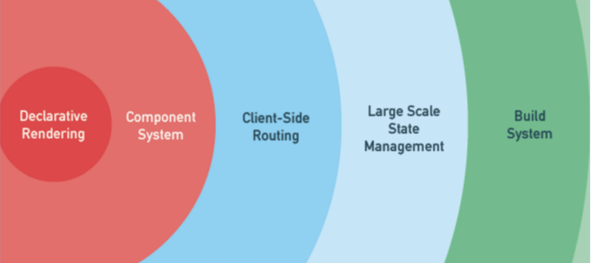

## 前言

## Vue.js概述

Vue 是一套用于构建用户界面的渐进式MVVM框架。那怎么理解`渐进式`呢？渐进式含义：强制主张最少。



Vue.js包含了声明式渲染、组件化系统、客户端路由、大规模状态管理、构建工具、数据持久化、跨平台支持等，但在实际开发中，并没有强制要求开发者之后某一特定功能，而是根据需求逐渐扩展。

Vue.js的核心库只关心视图渲染，且由于渐进式的特性，Vue.js便于与第三方库或既有项目整合。

## 组件机制

定义：组件就是对一个功能和样式进行独立的封装，让HTML元素得到扩展，从而使得代码得到复用，使得开发灵活，更加高效。

与HTML元素一样，Vue.js的组件拥有外部传入的属性（prop）和事件，除此之外，组件还拥有自己的状态（data），各个维度组合起来决定组件最终呈现的样子与交互的逻辑。

### 数据传递

每一个组件之间的作用域是孤立的，这个意味着组件之间的数据不应该出现引用关系，及时出现了引用关系，也不允许组件操作组件内部以外的其他数据。Vue中，允许外部向组件内部传递`prop`数据，组件内部需要显性地声明该`prop`字段，如下声明一个child组件：

```html
<!-- child.vue -->
<template>
    <div>{{msg}}</div>
</template>
<script>
export default {
    props: {
        msg: {
            type: String,
            default: 'hello world' // 当default为引用类型时，需要使用 function 形式返回
        }
    }
}
</script>
```

父组件向该组件传递数据：

```html
<!-- parent.vue -->
<template>
    <child :msg="parentMsg"></child>
</template>
<script>
import child from './child';
export default {
    components: {
        child
    },
    data () {
        return {
            parentMsg: 'some words'
        }
    }
}
</script>
```

### 事件传递

Vue内部实现了一个事件总线系统，即`EventBus`。在Vue中可以使用EventBus来作为沟通桥梁的概念，就像是所有组件共用相同的事件中心，每一个Vue的组件实例或者继承了Vue的子类，都可以接受事件`$on`和发送事件`$emit`。

如上面一个例子，child.vue组件想修改parent.vue组件的parentMsg数据，怎么办呢？为了保证数据流的可追溯性，直接修改组件内 prop 的 msg 字段是不提倡的，且例子中为非应用类型 String，直接修改也修改不了，这个时候需要将修改 parentMsg 的事件传递给 child.vue，让 child.vue 来触发修改 parentMsg 的事件。如：

```html
<!-- child.vue -->
<template>
    <div>{{msg}}</div>
</template>
<script>
export default {
    props: {
        msg: {
            type: String,
            default: 'hello world'
        }
    },
    methods: {
        changeMsg(newMsg) {
            this.$emit('updateMsg', newMsg);
        }
    }
}
</script>
```

父组件：

```html
<!-- parent.vue -->
<template>
    <child :msg="parentMsg" @updateMsg="changeParentMsg"></child>
</template>
<script>
import child from './child';
export default {
    components: {
        child
    },
    data () {
        return {
            parentMsg: 'some words'
        }
    },
    methods: {
        changeParentMsg: function (newMsg) {
            this.parentMsg = newMsg
        }
    }
}
</script>
```

父组件 parent.vue 向子组件 child.vue 传递了 updateMsg 事件，在子组件实例化的时候，子组件将 updateMsg 事件使用`$on`函数注册到组件内部，到要触发改事件的时候，调用函数`this.$emit`来触发事件。

除了父子组件之间的事件传递，还可以使用一个 Vue 实例为多层级的父子组件建立数据通信的桥梁，如：

```js
const eventBus = new Vue();

// 父组件中使用$on监听事件
eventBus.$on('eventName', val => {
    //  ...do something
})

// 子组件使用$emit触发事件
eventBus.$emit('eventName', 'this is a message.');
```

### 内容分发

Vue实现了一套遵循 [`Web Components 规范草案`](https://github.com/w3c/webcomponents/blob/gh-pages/proposals/Slots-Proposal.md) 的内容分发系统，即将`<slot>`元素作为承载分发内容的出口。

插槽slot，也是组件的一块HTML模板，这一块模板显示不显示、以及怎样显示由父组件来决定。实际上，一个slot最核心的两个问题在这里就点出来了，是显示不显示和怎样显示。

插槽又分默认插槽、具名插槽。

#### 默认插槽

又名单个插槽、匿名插槽，与具名插槽相对，这类插槽没有具体名字，一个组件只能有一个该类插槽。

如：

```html
<template>
<!-- 父组件 parent.vue -->
<div class="parent">
    <h1>父容器</h1>
    <child>
        <div class="tmpl">
            <span>菜单1</span>
        </div>
    </child>
</div>
</template>
```

```html
<template>
<!-- 子组件 child.vue -->
<div class="child">
    <h1>子组件</h1>
    <slot></slot>
</div>
</template>
```

如上，渲染时子组件的`slot`标签会被父组件传入的`div.tmpl`替换。

#### 具名插槽

匿名插槽没有name属性，所以叫匿名插槽。那么，插槽加了name属性，就变成了具名插槽。具名插槽可以在一个组件中出现N次，出现在不同的位置，只需要使用不同的name属性区分即可。

如：

```html
<template>
<!-- 父组件 parent.vue -->
<div class="parent">
    <h1>父容器</h1>
    <child>
        <div class="tmpl" slot="up">
            <span>菜单up-1</span>
        </div>
        <div class="tmpl" slot="down">
            <span>菜单down-1</span>
        </div>
        <div class="tmpl">
            <span>菜单->1</span>
        </div>
    </child>
</div>
</template>
```

```html
<template>
    <div class="child">
        <!-- 具名插槽 -->
        <slot name="up"></slot>
        <h3>这里是子组件</h3>
        <!-- 具名插槽 -->
        <slot name="down"></slot>
        <!-- 匿名插槽 -->
        <slot></slot>
    </div>
</template>
```

如上，slot 标签会根据父容器给 child 标签内传入的内容的 slot 属性值，替换对应的内容。

其实，默认插槽也有 name 属性值，为`default`，同样指定  slot 的 name 值为 default，一样可以显示父组件中传入的没有指定slot的内容。

#### 作用域插槽

作用域插槽可以是默认插槽，也可以是具名插槽，不一样的地方是，作用域插槽可以为 slot 标签绑定数据，让其父组件可以获取到子组件的数据。

如：

```html
<template>
    <!-- parent.vue -->
    <div class="parent">
        <h1>这是父组件</h1>
        <current-user>
            <template slot="default" slot-scope="slotProps">
                {{ slotProps.user.name }}
            </template>
        </current-user>
    </div>
</template>
```

```html
<template>
    <!-- child.vue -->
    <div class="child">
        <h1>这是子组件</h1>
        <slot :user="user"></slot>
    </div>
</template>
<script>
export default {
    data() {
        return {
            user: {
                name: '小赵'
            }
        }
    }
}
</script>
```

如上例子，子组件 child 在渲染默认插槽 slot 的时候，将数据 user 传递给了 slot 标签，在渲染过程中，父组件可以通过`slot-scope`属性获取到 user 数据并渲染视图。

## 模板渲染

Vue.js 的核心是声明式渲染，与命令式渲染不同，声明式渲染只需要告诉程序，我们想要的什么效果，其他的事情让程序自己去做。而命令式渲染，需要命令程序一步一步根据命令执行渲染。如下例子区分：

```js
var arr = [1, 2, 3, 4, 5];

// 命令式渲染，关心每一步、关心流程。用命令去实现
var newArr = [];
for (var i = 0; i < arr.length; i++) {
    newArr.push(arr[i] * 2);
}

// 声明式渲染，不用关心中间流程，只需要关心结果和实现的条件
var newArr1 = arr.map(function (item) {
    return item * 2;
});
```

Vue.js 允许采用简洁的模板语法来声明式地将数据渲染出视图。

### 模板编译

为什么要进行模板编译？实际上，我们组件中的 template 语法是无法被浏览器解析的，因为它不是正确的 HTML 语法，而模板编译，就是将组件的 template 编译成可执行的 JavaScript 代码，即将 template 转化为真正的渲染函数。

模板编译分三个阶段，`parse`、`optimize`、`generate`，最终生成`render`函数。

`parse`阶段：使用正在表达式将`template`进行字符串解析，得到指令、class、style等数据，生成抽象语法树 AST。

`optimize`阶段：寻找 AST 中的静态节点进行标记，为后面 VNode 的 patch 过程中对比做优化。被标记为 static 的节点在后面的 diff 算法中会被直接忽略，不做详细的比较。

`generate`阶段：根据 AST 结构拼接生成 render 函数的字符串。

### 预编译

对于 Vue 组件来说，模板编译只会在组件实例化的时候编译一次，生成渲染函数之后在也不会进行编译。因此，编译这对组件的 runtime 是一种性能损耗。而模板编译的目的仅仅是将`template`转化为`render function`，而这个过程，正好可以在项目构建的过程中完成。

比如`webpack`的`vue-loader`中，依赖了[`vue-template-compiler`](https://www.npmjs.com/package/vue-template-compiler)模块，在 webpack 构建过程中，将预编译成 render 函数，在 runtime 可直接跳过模板编译过程。

回过头看，runtime 需要是仅仅是 render 函数，而我们有了预编译之后，我们只需要保证构建过程中生成 render 函数就可以。与 React 类似，在添加`JSX`的语法糖编译器[`babel-plugin-transform-vue-jsx`](https://www.npmjs.com/package/babel-plugin-transform-vue-jsx)之后，我们可以为 Vue 组件，使用`JSX`语法直接书写 render 函数。

```html
<script>
export default {
    data() {
        return {
            msg: 'Hello JSX.'
        }
    },
    render() {
        const msg = this.msg;
        return <div>
            {msg}
        </div>;
    }
}
</script>
```

如上面组件，使用 JSX 之后，可以在 JS 代码中直接使用 html 标签，而且声明了 render 函数以后，我们不再需要声明 template。当然，假如我们同时声明了 template 标签和 render 函数，构建过程中，template 编译的结果将覆盖原有的 render 函数，即 template 的优先级高于直接书写的 render 函数。

相对于 template 而言，JSX 具有更高的灵活性，面对与一些复杂的组件来说，JSX 有着天然的优势，而 template 虽然显得有些呆滞，但是代码结构上更符合视图与逻辑分离的习惯，更简单、更直观、更好维护。

需要注意的是，最后生成的 render 函数是被包裹在`with`语法中运行的。

## 响应式数据

简述：

### 响应式原理

### 依赖收集与数据追踪


## VNode

简述

### 抽象DOM树

### Diff


## 事件机制

## nextTick


## 总结

## 参考

* [聊聊 VueJs 组件化编程](https://mp.weixin.qq.com/s?__biz=MzIyMDEwNzIwNQ==&mid=2649619127&idx=1&sn=e75d7ae41b679b9e2f558bee8f1ea82d&scene=4#wechat_redirect)

* [深入理解vue中的slot与slot-scope](https://juejin.im/post/5a69ece0f265da3e5a5777ed?utm_source=gold_browser_extension)

