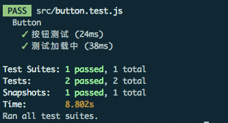
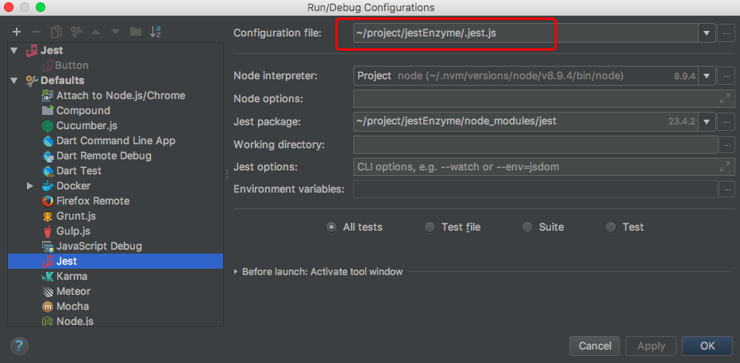
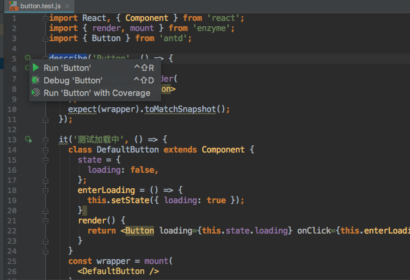

## 前言

[Jest](https://facebook.github.io/jest/) 是 Facebook 开发的一个测试框架，它集成了测试执行器、断言库、spy、mock、snapshot和测试覆盖率报告等功能。React项目本身也是使用Jest进行单测的，因此它们俩的契合度相当高。

[Enzyme](http://airbnb.io/enzyme/) 是由 airbnb 开发的React单测工具。它扩展了React的TestUtils并通过支持类似jQuery的find语法可以很方便的对render出来的结果做各种断言。

Jest+Enzyme是目前比较流行的React项目单测组合。

## 安装与配置

```
npm install --save-dev jest jest-cli enzyme
```

在package.json中添加jest命令，并指定配置文件.jest.js

```
scripts: {
  "test": "jest --config .jest.js"
}
```

在项目根目录新建配置文件.jest.js，如下

```js
module.exports = {
  setupFiles: [
    './tests/setup.js',  // 测试启动文件
  ],
  testURL: 'http://localhost', // 测试环境URL
  testEnvironment: 'jsdom', // 测试环境
  moduleFileExtensions: ['js', 'jsx'], // 单元测试文件检测后缀名
  testPathIgnorePatterns: ['/node_modules/'],
  moduleNameMapper: { // mock模块
    "\\.(jpg|jpeg|png|gif|eot|otf|webp|svg|ttf|woff|woff2|mp4|webm|wav|mp3|m4a|aac|oga)$": "<rootDir>/tests/__mocks__/fileMock.js",
    "\\.(css|less)$": "<rootDir>/tests/__mocks__/cssMock.js"
  },
  transformIgnorePatterns: [ // 不转化es6的文件夹匹配
    'node_modules\/[^/]+?\/(?!(es|node_modules)\/)', // Ignore modules without es dir
  ]
};
```

由配置文件的testEnvironment可以看到，测试环境使用的是`jsdom`，jsdom 为许多 WEB标准的 JavaScript 实现，它主要是为了在服务器端模拟足够的Web浏览器子集，以便进行自动化测试。

由于jest默认不支持es6和jsx语法，我们需要通过babel对其进行转化，在项目根目录新建.babelrc文件：

```json
{
  "env": {
    "test": {
      "presets": ["es2015", "react", "stage-2"]
    }
  }
}
```

对于测试环境来说，一些模块我们不需要进行处理，比如图片模块、样式模块，我们需要把这些模块mock掉，通过moduleNameMapper配置，把指定文件后缀的模块使用自定义文件mock掉，如图片模块，我们新建/tests/\_\_mock__/fileMock.js文件：

```
module.exports = {}
```

导出一个空对象来mock图片文件。

对于一些css、less等文件，可能涉及到一些css-module的内容，可能引入的模块里包含了css中:export导出的内容，如classPrefix，这个时候如果导出空对象可能会影响测试的结果，我们这里针对项目导出写死的内容，/tests/\_\_mock__/cssMock.js如下：

```js
module.exports = {
  prefix: "test",
  switchPrefix: "test-switch",
  btnPrefix: "test-btn",
  inputPrefix: "test-input"
}
```

这个时候当我们导入css模块时候，我们可以模拟到css-module的功能，使用s.prefix取到test字符串。

接下来新建启动文件/tests/setup.js

```js
import { JSDOM } from 'jsdom';

// fixed jsdom miss
if (typeof window !== 'undefined') {
  const documentHTML = '<!doctype html><html><body</body></html>';
  global.document = new JSDOM(documentHTML); // 模拟 document 对象
  global.window = document.parentWindow; // 模拟 window 对象
}

global.requestAnimationFrame = global.requestAnimationFrame || function (cb) {  // 处理兼容 添加 requestAnimationFrame 动画函数
  return setTimeout(cb, 0);
};

const Enzyme = require('enzyme');

const Adapter = require('enzyme-adapter-react-16'); 

Enzyme.configure({ adapter: new Adapter() }); // 为 enzyme 添加适配器，针对不同的react版本使用不同的适配器

```

## 编写单元测试

默认情况下，jest会检测`__tests__`文件下的所有`.js`和`.jsx`后缀以及项目中`.test.js`和`.spec.js`后缀(包括jsx)的文件，以标记这些文件为单元测试文件。

以antd为例，新建一个button.test.js文件：

```js
import React, { Component } from 'react';
import { render, mount } from 'enzyme';
import { Button } from 'antd';

describe('Button', () => {
  it('按钮测试', () => {
    const wrapper = render(
      <Button>测试</Button>
    );
    expect(wrapper).toMatchSnapshot();
  });

  it('测试加载中', () => {
    class DefaultButton extends Component {
      state = {
        loading: false,
      };
      enterLoading = () => {
        this.setState({ loading: true });
      }
      render() {
        return <Button loading={this.state.loading} onClick={this.enterLoading}>Button</Button>;
      }
    }
    const wrapper = mount(
      <DefaultButton />
    );
    wrapper.simulate('click');
    expect(wrapper.find('.ant-btn-loading').length).toBe(1);
  });
})
```

`toMatchSnapshot`方法会测试两次单测渲染的结果是否一致。

执行命令 `npm run test`，结果如下：



enzyme提供了三种渲染方式，`render`、`mount`、`shallow`，分别存在以下区别：

* `render`采用的是第三方库Cheerio的渲染，渲染结果是普通的html结构，对于snapshot使用render比较合适。
* `shallow`和`mount`对组件的渲染结果不是html的dom树，而是react树，如果你chrome装了react devtool插件，他的渲染结果就是react devtool tab下查看的组件结构，而render函数的结果是element tab下查看的结果。
* `shallow`和`mount`的结果是个被封装的`ReactWrapper`，可以进行多种操作，譬如`find()、parents()、children()`等选择器进行元素查找；`state()`、`props()`进行数据查找，setState()、setprops()操作数据；simulate()模拟事件触发。
* `shallow`只渲染当前组件，只能能对当前组件做断言；`mount`会渲染当前组件以及所有子组件，对所有子组件也可以做上述操作。一般交互测试都会关心到子组件，我使用的都是mount。但是mount耗时更长，内存啥的也都占用的更多，如果没必要操作和断言子组件，可以使用shallow。

enzyme还提供了`simulate()`接口模拟事件，实际上simulate是通过触发事件绑定函数，来模拟事件的触发。触发事件后，去判断props上特定函数是否被调用，传参是否正确；组件状态是否发生预料之中的修改；某个dom节点是否存在是否符合期望。

## WebStorm集成jest进行单测调试

自 WebStorm 2017.3之后的版本（之前几个版本也有，但是不知道怎么试都不行），WebStorm也提供了jest的单元测试环境，下面结合我们前面的项目进行配置：

打开debug配置窗口，在defaults里面找到jest，修改jest的全局配置，选择jest配置文件，如下：



选择完后点击确定，然后找到对应的单元测试文件，点击左边的运行键，如下：



选择 Debug 即可在对应的位置打断点进行调试。

## 总结

单元测试的目的是为了检测一段代码在特定条件下某个特定的函数行为，对程序员来说，单元测试还是很必要的存在，因为测试人员不会完全把bug测出来，这个时候为了更好的发现bug，我们就需要单元测试来保证测试的全面性。

上面项目 [github传送门](https://github.com/yacan8/jest-enzyme)。


