## 前言

在我们面试过程中，面试官经常会问到这么一个问题，那就是从在浏览器地址栏中输入URL到页面显示，浏览器到底发生了什么？这个问题看起来是老生常谈，但是这个问题回答的好坏，确实可以很好的反映出面试者知识的广度和深度。

本文从浏览器角度来告诉你，URL后输入后按回车，浏览器内部究竟发生了什么，读完本文后，你将了解到：

* 浏览器内有哪些进程，这些进程都有些什么作用
* 浏览器地址输入URL后，内部的进程、线程都做了哪些事
* 我们与浏览器交互时，内部进程是怎么处理这些交互事件的

## 浏览器架构

在讲浏览器架构之前，先理解两个概念，`进程`和`线程`。

进程（process）是程序的一次执行过程，是一个动态概念，是程序在执行过程中分配和管理资源的基本单位，线程（thread）是CPU调度和分派的基本单位，它可与同属一个进程的其他的线程共享进程所拥有的全部资源。

简单的说呢，进程可以理解成正在执行的应用程序，而线程呢，可以理解成我们应用程序中的代码的执行器。而他们的关系可想而知，**线程是跑在进程里面的**，一个进程里面可能有一个或者多个线程，而一个线程，只能隶属于一个进程。

大家都知道，浏览器属于一个应用程序，而应用程序的一次执行，可以理解为计算机启动了一个`进程`，进程启动后，CPU会给该进程分配相应的内存空间，当我们的进程得到了内存之后，就可以使用`线程`进行资源调度，进而完成我们应用程序的功能。

而在应用程序中，为了满足功能的需要，启动的进程会创建另外的新的进程来处理其他任务，这些创建出来的新的进程拥有全新的独立的内存空间，不能与原来的进程内向内存，如果这些进程之间需要通信，可以通过IPC机制（Inter Process Communication）来进行。

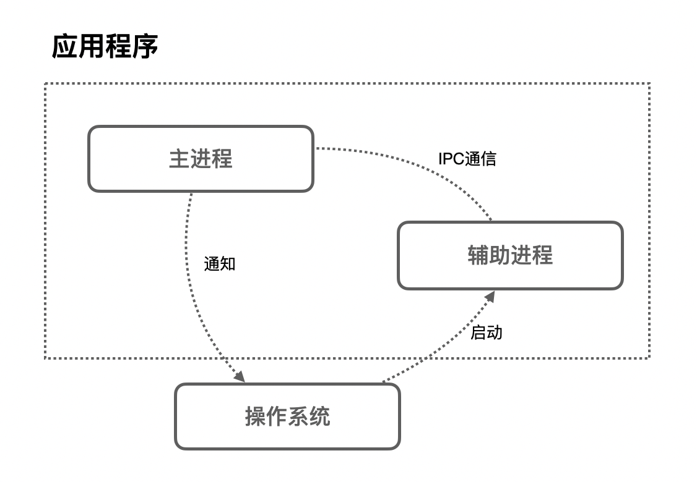

很多应用程序都会采取这种多进程的方式来工作，因为进程和进程之间是互相独立的它们`互不影响`，也就是说，当其中一个进程挂掉了之后，不会影响到其他进程的执行，只需要重启挂掉的进程就可以恢复运行。

### 浏览器的多进程架构

假如我们去开发一个浏览器，它的架构可以是一个单进程多线程的应用程序，也可以是一个使用IPC通信的多进程应用程序。

不同的浏览器使用不同的架构，下面主要以Chrome为例，介绍浏览器的多进程架构。

在Chrome中，主要的进程有4个：

* 浏览器进程 (Browser Process)：负责浏览器的TAB的前进、后退、地址栏、书签栏的工作和处理浏览器的一些不可见的底层操作，比如网络请求和文件访问。
* 渲染进程 (Renderer Process)：负责一个Tab内的显示相关的工作，也称渲染引擎。
* 插件进程 (Plugin Process)：负责控制网页使用到的插件
* GPU进程 (GPU Process)：负责处理整个应用程序的GPU任务

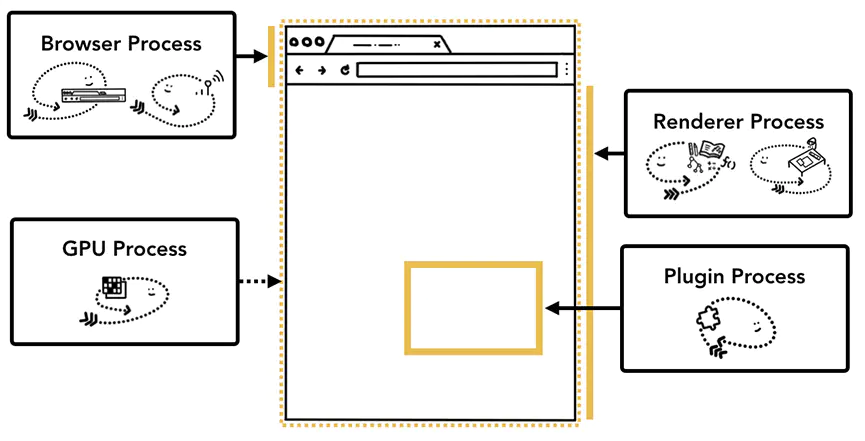

这4个进程之间的关系是什么呢？

首先，当我们是要浏览一个网页，我们会在浏览器的地址栏里输入URL，这个时候`Browser Process`会向这个URL发送请求，获取这个URL的HTML内容，然后将HTML交给`Renderer Process`，`Renderer Process`解析HTML内容，解析遇到需要请求网络的资源又返回来交给`Browser Process`进行加载，同时通知`Browser Process`，需要`Plugin Process`加载插件资源，执行插件代码。解析完成后，`Renderer Process`计算得到图像帧，并将这些图像帧交给`GPU Process`，`GPU Process`将其转化为图像显示屏幕。

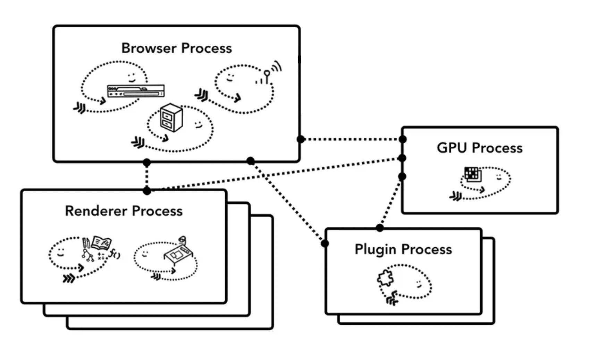

### 多进程架构的好处

Chrome为什么要使用多进程架构呢？

第一，更高的容错性。当今WEB应用中，HTML，JavaScript和CSS日益复杂，这些跑在渲染引擎的代码，频繁的出现BUG，而有些BUG会直接导致渲染引擎崩溃，多进程架构使得每一个渲染引擎运行在各自的进程中，相互之间不受影响，也就是说，当其中一个页面崩溃挂掉之后，其他页面还可以正常的运行不收影响。

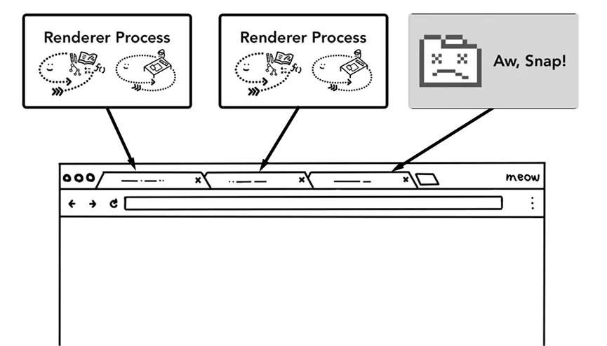

第二，更高的安全性和沙盒性（sanboxing）。渲染引擎会经常性的在网络上遇到不可信、甚至是恶意的代码，它们会利用这些漏洞在你的电脑上安装恶意的软件，针对这一问题，浏览器对不同进程限制了不同的权限，并为其提供沙盒运行环境，使其更安全更可靠

第三，更高的响应速度。在单进程的架构中，各个任务相互竞争抢夺CPU资源，使得浏览器响应速度变慢，而多进程架构正好规避了这一缺点。

### 多进程架构优化

之前的我们说到，`Renderer Process`的作用是负责一个Tab内的显示相关的工作，这就意味着，一个Tab，就会有一个Renderer Process，这些进程之间的内存无法进行共享，而不同进程的内存常常需要包含相同的内容。

#### 浏览器的进程模式

为了节省内存，Chrome提供了四种进程模式（Process Models），不同的进程模式会对 tab 进程做不同的处理。

* **Process-per-site-instance** (default) - 同一个 **site-instance** 使用一个进程
* **Process-per-site -** 同一个 **site** 使用一个进程
* **Process-per-tab -** 每个 tab 使用一个进程
* **Single process -** 所有 tab 共用一个进程

这里需要给出 site 和 site-instance 的定义

* **site** 指的是相同的 registered domain name(如： google.com ，bbc.co.uk)和scheme (如：https://)。比如a.baidu.com和b.baidu.com就可以理解为同一个 site（注意这里要和 [Same-origin policy](https://developer.mozilla.org/en-US/docs/Web/Security/Same-origin_policy) 区分开来，同源策略还涉及到子域名和端口）。
* **site-instance** 指的是一组 **connected pages from the same site**，这里 **connected** 的定义是 **can obtain references to each other in script code** 怎么理解这段话呢。满足下面两中情况并且打开的新页面和旧页面属于上面定义的同一个 site，就属于同一个 **site-instance**
  * 用户通过`<a target="_blank">`这种方式点击打开的新页面
  * JS代码打开的新页面（比如 `window.open`)

理解了概念之后，下面解释四个进程模式

首先是`Single process`，顾名思义，单进程模式，所有tab都会使用同一个进程。接下来是`Process-per-tab` ，也是顾名思义，每打开一个tab，会新建一个进程。而对于`Process-per-site`，当你打开 a.baidu.com 页面，在打开 b.baidu.com 的页面，这两个页面的tab使用的是共一个进程，因为这两个页面的site相同，而如此一来，如果其中一个tab崩溃了，而另一个tab也会崩溃。

`Process-per-site-instance` 是最重要的，因为这个是 Chrome 默认使用的模式，也就是几乎所有的用户都在用的模式。当你打开一个 tab 访问 a.baidu.com ，然后再打开一个 tab 访问 b.baidu.com，这两个 tab 会使用**两个进程**。而如果你在 a.baidu.com 中，通过JS代码打开了 b.baidu.com 页面，这两个 tab 会使用**同一个进程**。

#### 默认模式选择

那么为什么浏览器使用`Process-per-site-instance`作为默认的进程模式呢？

`Process-per-site-instance`兼容了性能与易用性，是一个比较中庸通用的模式。

* 相较于 Process-per-tab，能够少开很多进程，就意味着更少的内存占用
* 相较于 Process-per-site，能够更好的隔离相同域名下毫无关联的 tab，更加安全

## 导航过程都发生了什么

前面我们讲了浏览器的多进程架构，讲了多进程架构的各种好处，和Chrome是怎么优化多进程架构的，下面从用户浏览网页这一简单的场景，来深入了解进程和线程是如何呈现我们的网站页面的。

### 网页加载过程

之前我们我们提到，tab以外的大部分工作由浏览器进程`Browser Process`负责，针对工作的不同，Browser Process 划分出不同的工作线程：

* UI thread：控制浏览器上的按钮及输入框；
* network thread：处理网络请求，从网上获取数据；
* storage thread： 控制文件等的访问；


#### 第一步：处理输入

当我们在浏览器的地址栏输入内容按下回车时，`UI thread`会判断输入的内容是搜索关键词（search query）还是URL，如果是搜索关键词，跳转至默认搜索引擎对应都搜索URL，如果输入的内容是URL，则开始请求URL。

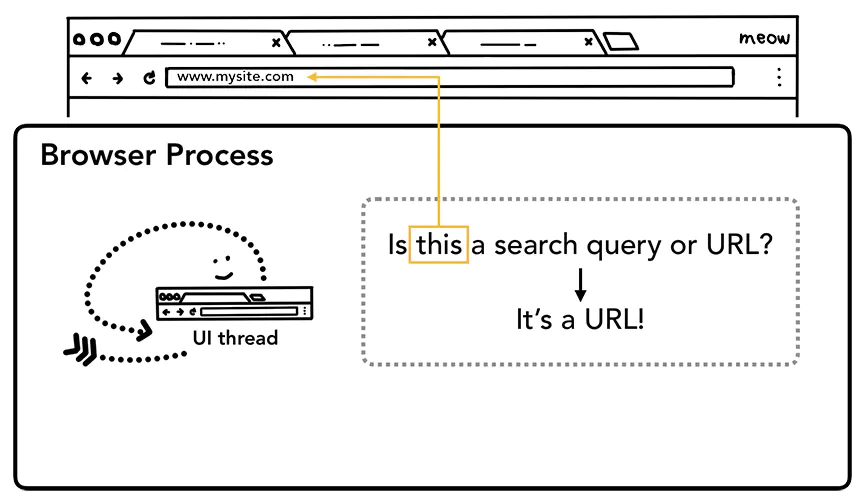

#### 第二步：开始导航

回车按下后，`UI thread`将关键词搜索对应的URL或输入的URL交给网络线程`Network thread`，此时UI线程使Tab前的图标展示为加载中状态，然后网络进程进行一系列诸如DNS寻址，建立TLS连接等操作进行资源请求，如果收到服务器的301重定向响应，它就会告知UI线程进行重定向然后它会再次发起一个新的网络请求。

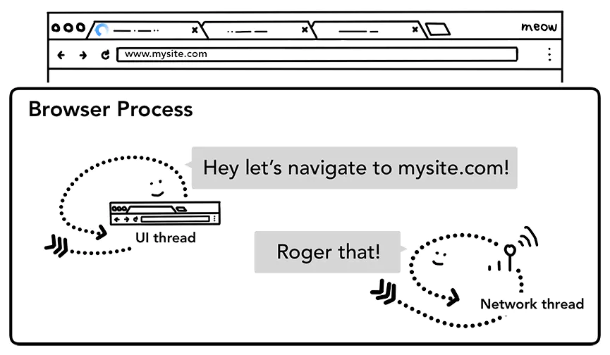

#### 第三步：读取响应

`network thread`接收到服务器的响应后，开始解析HTTP响应报文，然后根据响应头中的`Content-Type`字段来确定响应主体的媒体类型（MIME Type），如果媒体类型是一个HTML文件，则将响应数据交给渲染进程（renderer process）来进行下一步的工作，如果是 zip 文件或者其它文件，会把相关数据传输给下载管理器。

与此同时，浏览器会进行 [Safe Browsing](https://safebrowsing.google.com/) 安全检查，如果域名或者请求内容匹配到已知的恶意站点，network thread 会展示一个警告页。除此之外，网络线程还会做 [CORB](https://www.chromium.org/Home/chromium-security/corb-for-developers)（Cross Origin Read Blocking）检查来确定那些敏感的跨站数据不会被发送至渲染进程。

#### 第四步：查找渲染进程

各种检查完毕以后，network thread 确信浏览器可以导航到请求网页，network thread 会通知 UI thread 数据已经准备好，UI thread 会查找到一个 renderer process 进行网页的渲染。

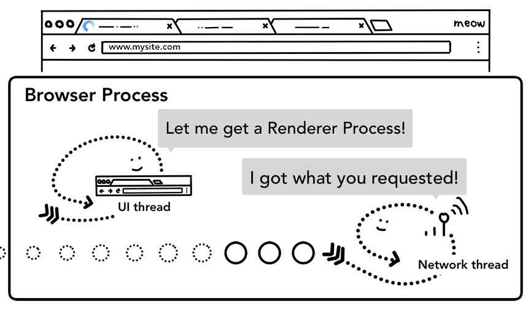

浏览器为了对查找渲染进程这一步骤进行优化，考虑到网络请求获取响应需要时间，所以在第二步开始，浏览器已经预先查找和启动了一个渲染进程，如果中间步骤一切顺利，当 network thread 接收到数据时，渲染进程已经准备好了，但是如果遇到重定向，这个准备好的渲染进程也许就不可用了，这个时候会重新启动一个渲染进程。

#### 第五步：提交导航

到了这一步，数据和渲染进程都准备好了，`Browser Process` 会向 `Renderer Process ` 发送IPC消息来确认导航，此时，浏览器进程将准备好的数据发送给渲染进程，渲染进程接收到数据之后，又发送IPC消息给浏览器进程，告诉浏览器进程导航已经提交了，页面开始加载。

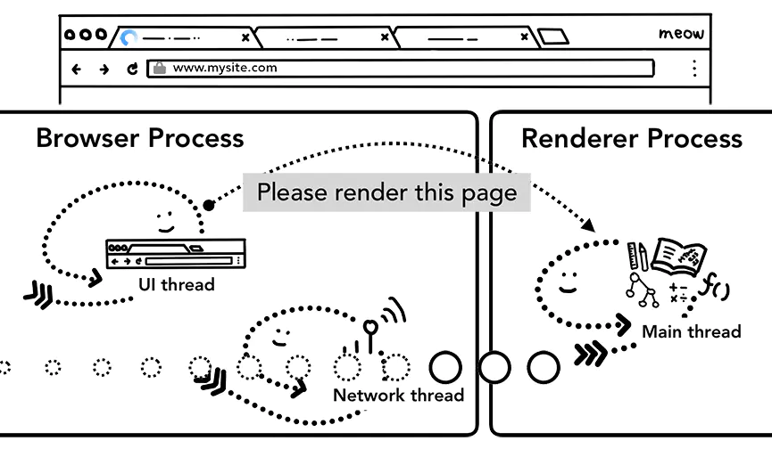

这个时候导航栏会更新，安全指示符更新（地址前面的小锁），访问历史列表（history tab）更新，即可以通过前进后退来切换该页面。

#### 第六步：初始化加载完成

当导航提交完成后，渲染进程开始加载资源及渲染页面（详细内容下文介绍），当页面渲染完成后（页面及内部的iframe都触发了onload事件），会向浏览器进程发送IPC消息，告知浏览器进程，这个时候UI thread会停止展示tab中的加载中图标。

### 网页渲染原理

导航过程完成之后，浏览器进程把数据交给了渲染进程，渲染进程负责tab内的所有事情，核心目的就是将HTML/CSS/JS代码，转化为用户可进行交互的web页面。那么渲染进程是如何工作的呢？

渲染进程中，包含线程分别是：

* 一个主线程（main thread）
* 多个工作线程（work thread）
* 一个合成器线程（compositor thread）
* 多个光栅化线程（raster thread）

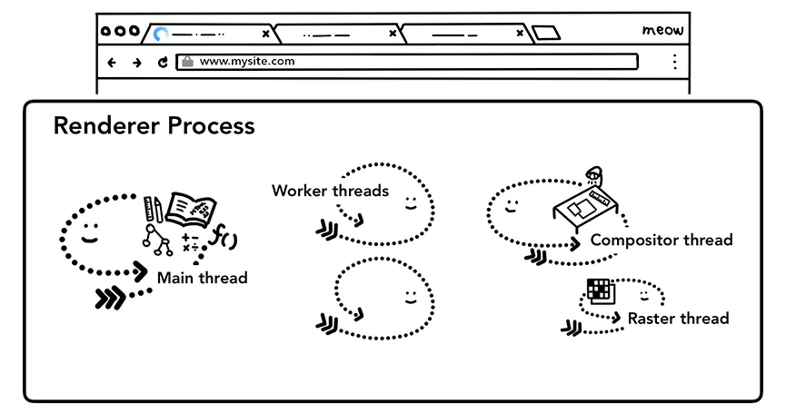

不同的线程，有着不同的工作职责。

#### 构建DOM

当渲染进程接受到导航的确认信息后，开始接受来自浏览器进程的数据，这个时候，主线程会解析数据转化为DOM（Document Object Model）对象。

DOM为WEB开发人员通过JavaScript与网页进行交互的数据结构及API。

####  资源子加载

在构建DOM的过程中，会解析到图片、CSS、JavaScript脚本等资源，这些资源是需要从网络或者缓存中获取的，主线程在构建DOM过程中如果遇到了这些资源，逐一发起请求去获取，而为了提升效率，浏览器也会运行预加载扫描（preload scanner）程序，如果如果HTML中存在`img`、`link`等标签，预加载扫描程序会把这些请求传递给`Browser Process`的network thread进行资源下载。

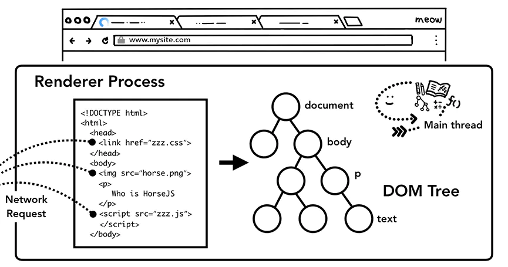

#### JavaScript的下载与执行

构建DOM过程中，如果遇到`<script>`标签，渲染引擎会停止对HTML的解析，而去加载执行JS代码，原因在于JS代码可能会改变DOM的结构（比如执行`document.write()`等API）

不过开发者其实也有多种方式来告知浏览器应对如何应对某个资源，比如说如果在`<script>` 标签上添加了 `async` 或 `defer` 等属性，浏览器会异步的加载和执行JS代码，而不会阻塞渲染。

#### 样式计算 - Style calculation

DOM树只是我们页面的结构，我们要知道页面长什么样子，我们还需要知道DOM的每一个节点的样式。主线程在解析页面时，遇到`<style>`标签或者`<link>`标签的CSS资源，会加载CSS代码，根据CSS代码确定每个DOM节点的计算样式（computed style）。

计算样式是主线程根据CSS样式选择器（CSS selectors）计算出的每个DOM元素应该具备的具体样式，即使你的页面没有设置任何自定义的样式，浏览器也会提供其默认的样式。

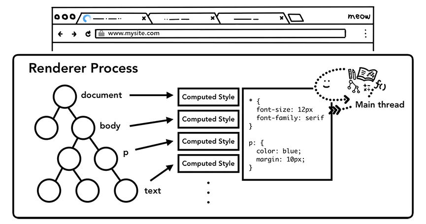

#### 布局 - Layout

DOM树和计算样式完成后，我们还需要知道每一个节点在页面上的位置，布局（Layout）其实就是找到所有元素的几何关系的过程。

主线程会遍历DOM 及相关元素的计算样式，构建出包含每个元素的页面坐标信息及盒子模型大小的布局树（Render Tree），遍历过程中，会跳过隐藏的元素（display: none），另外，伪元素虽然在DOM上不可见，但是在布局树上是可见的。

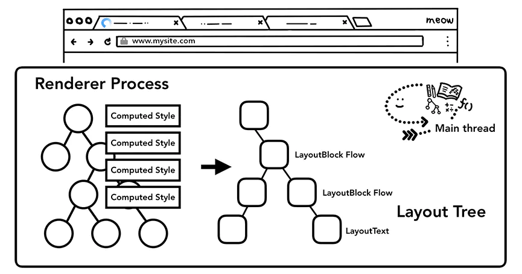

#### 绘制 - Paint

布局 layout 之后，我们知道了不同元素的结构，样式，几何关系，我们要绘制出一个页面，我们要需要知道每个元素的绘制先后顺序，在绘制阶段，主线程会遍历布局树（layout tree），生成一系列的绘画记录（paint records）。绘画记录可以看做是记录各元素绘制先后顺序的笔记。

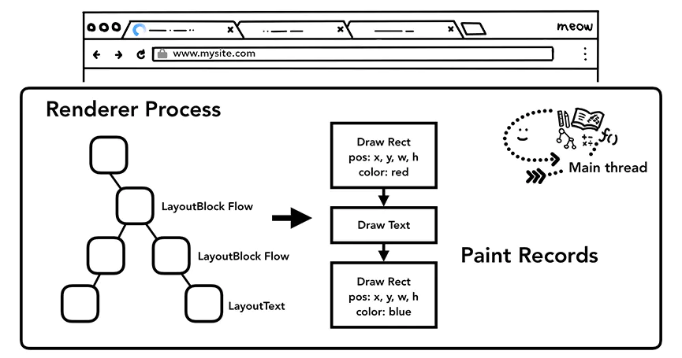

#### 合成 - Compositing

文档结构、元素的样式、元素的几何关系、绘画顺序，这些信息我们都有了，这个时候如果要绘制一个页面，我们需要做的是把这些信息转化为显示器中的像素，这个转化的过程，叫做`光栅化`（rasterizing）。

那我们要绘制一个页面，最简单的做法是只光栅化视口内（viewport）的网页内容，如果用户进行了页面滚动，就移动光栅帧（rastered frame）并且光栅化更多的内容以补上页面缺失的部分，如下：

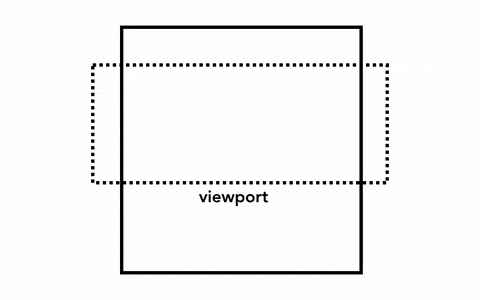

Chrome第一个版本就是采用这种简单的绘制方式，这一方式唯一的缺点就是每当页面滚动，光栅线程都需要对新移进视图的内容进行光栅化，这是一定的性能损耗，为了优化这种情况，Chrome采取一种更加复杂的叫做合成（compositing）的做法。

那么，什么是合成？合成是一种将**页面分成若干层**，然后分别对它们进行光栅化，最后在一个单独的线程 - 合成线程（compositor thread）里面合并成一个页面的技术。当用户滚动页面时，由于页面各个层都已经被光栅化了，浏览器需要做的只是合成一个新的帧来展示滚动后的效果罢了。页面的动画效果实现也是类似，将页面上的层进行移动并构建出一个新的帧即可。

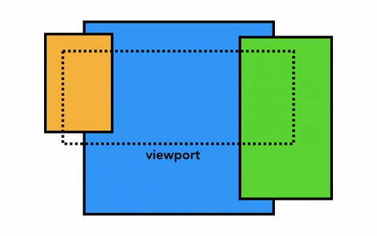

为了实现合成技术，我们需要对元素进行分层，确定哪些元素需要放置在哪一层，主线程需要遍历渲染树来创建一棵层次树（Layer Tree），对于添加了 `will-change` CSS 属性的元素，会被看做单独的一层，没有 `will-change` CSS属性的元素，浏览器会根据情况决定是否要把该元素放在单独的层。

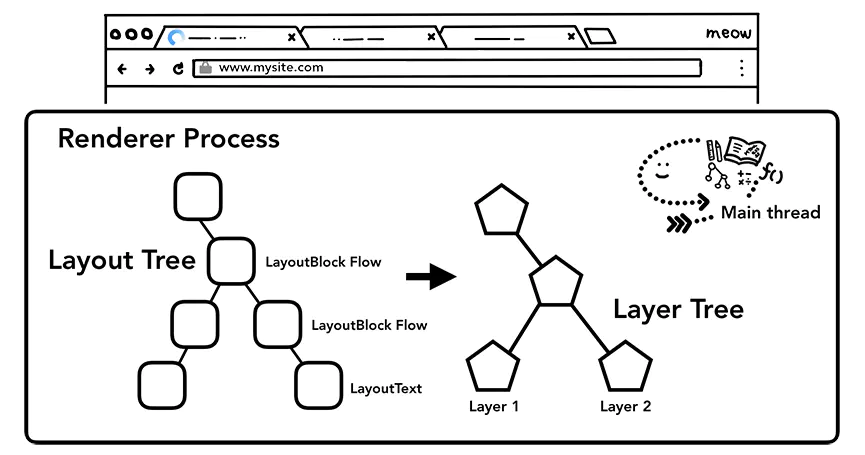

你可能会想要给页面上所有的元素一个单独的层，然而当页面的层超过一定的数量后，层的合成操作要比在每个帧中光栅化页面的一小部分还要慢，因此衡量你应用的渲染性能是十分重要的一件事情。

一旦Layer Tress被创建，渲染顺序被确定，主线程会把这些信息通知给合成器线程，合成器线程开始对层次数的每一层进行光栅化。有的层的可以达到整个页面的大小，所以合成线程需要将它们切分为一块又一块的小图块（tiles），之后将这些小图块分别进行发送给一系列光栅线程（raster threads）进行光栅化，结束后光栅线程会将每个图块的光栅结果存在`GPU Process`的内存中。

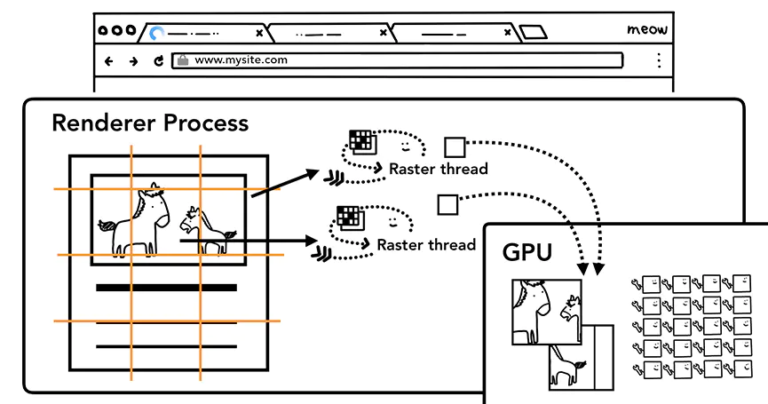

为了优化显示体验，合成线程可以给不同的光栅线程赋予不同的优先级，将那些在视口中的或者视口附近的层先被光栅化。

当图层上面的图块都被栅格化后，合成线程会收集图块上面叫做**绘画四边形**（draw quads）的信息来构建一个**合成帧**（compositor frame）。

- 绘画四边形：包含图块在**内存的位置**以及图层合成后图块在页面的位置之类的信息。
- 合成帧：代表页面一个帧的内容的绘制四边形**集合**。

以上所有步骤完成后，合成线程就会通过IPC向浏览器进程（browser process）提交（commit）一个渲染帧。这个时候可能有另外一个合成帧被浏览器进程的UI线程（UI thread）提交以改变浏览器的UI。这些合成帧都会被发送给GPU从而展示在屏幕上。如果合成线程收到页面滚动的事件，合成线程会构建另外一个合成帧发送给GPU来更新页面。

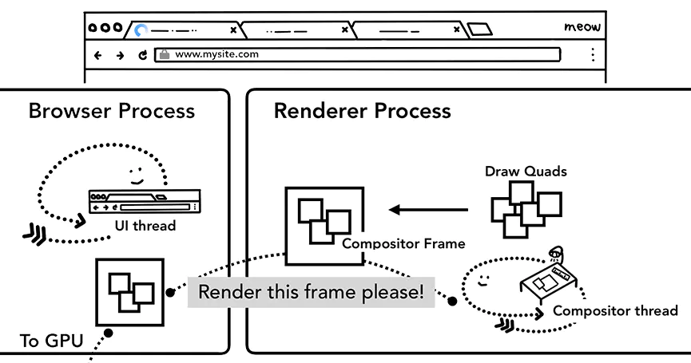

合成的好处在于这个过程没有涉及到主线程，所以合成线程不需要等待样式的计算以及JavaScript完成执行。这就是为什么[合成器相关的动画](https://www.html5rocks.com/en/tutorials/speed/high-performance-animations/)最流畅，如果某个动画涉及到布局或者绘制的调整，就会涉及到主线程的重新计算，自然会慢很多。

## 浏览器对事件的处理

当页面渲染完毕以后，TAB内已经显示出了可交互的WEB页面，用户可以进行移动鼠标、点击页面等操作了，而当这些事件发生时候，浏览器是如何处理这些事件的呢？

以点击事件（click event）为例，让鼠标点击页面时候，首先接受到事件信息的是`Browser Process`，但是Browser Process只知道事件发生的类型和发生的位置，具体怎么对这个点击事件进行处理，还是由Tab内的`Renderer Process`进行的。Browser Process接受到事件后，随后便把事件的信息传递给了渲染进程，渲染进程会找到根据事件发生的坐标，找到目标对象（target），并且运行这个目标对象的点击事件绑定的监听函数（listener）。

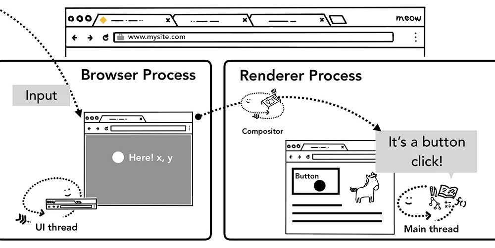

### 渲染进程中合成器线程接收事件

前面我们说到，合成器线程可以独立于主线程之外通过已光栅化的层创建组合帧，例如页面滚动，如果没有对页面滚动绑定相关的事件，组合器线程可以独立于主线程创建组合帧，如果页面绑定了页面滚动事件，合成器线程会等待主线程进行事件处理后才会创建组合帧。那么，合成器线程是如何判断出这个事件是否需要路由给主线程处理的呢？

由于执行 JS 是主线程的工作，当页面合成时，合成器线程会标记页面中绑定有事件处理器的区域为`非快速滚动区域`(non-fast scrollable region)，如果事件发生在这些存在标注的区域，合成器线程会把事件信息发送给主线程，等待主线程进行事件处理，如果事件不是发生在这些区域，合成器线程则会直接合成新的帧而不用等到主线程的响应。

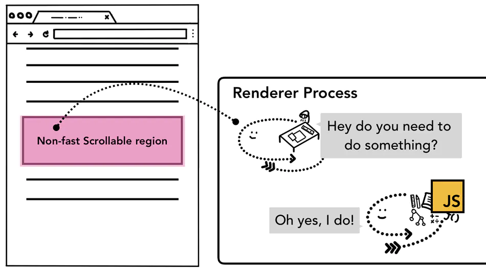

而对于非快速滚动区域的标记，开发者需要注意全局事件的绑定，比如我们使用事件委托，将目标元素的事件交给根元素body进行处理，代码如下：

```js
document.body.addEventListener('touchstart', event => {
  if (event.target === area) {
    event.preventDefault()
  }
})
```

在开发者角度看，这一段代码没什么问题，但是从浏览器角度看，这一段代码给body元素绑定了事件监听器，也就意味着整个页面都被编辑为一个非快速滚动区域，这会使得即使你的页面的某些区域没有绑定任何事件，每次用户触发事件时，合成器线程也需要和主线程通信并等待反馈，流畅的合成器独立处理合成帧的模式就失效了。

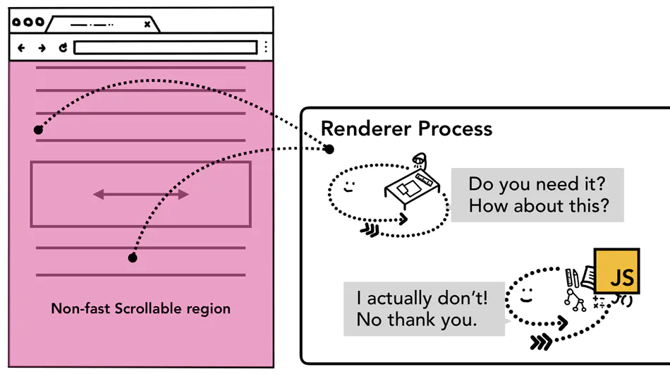

其实这种情况也很好处理，只需要在事件监听时传递`passtive`参数为 true，`passtive`会告诉浏览器你既要绑定事件，又要让组合器线程直接跳过主线程的事件处理直接合成创建组合帧。

```js
document.body.addEventListener('touchstart', 
event => {
    if (event.target === area) {
        event.preventDefault()
    }
 }, {passive: true});
```

### 查找事件的目标对象（event target）

当合成器线程接收到事件信息，判定到事件发生不在非快速滚动区域后，合成器线程会向主线程发送这个时间信息，主线程获取到事件信息的第一件事就是通过命中测试（hit test）去找到事件的目标对象。具体的命中测试流程是遍历在绘制阶段生成的绘画记录（paint records）来找到包含了事件发生坐标上的元素对象。

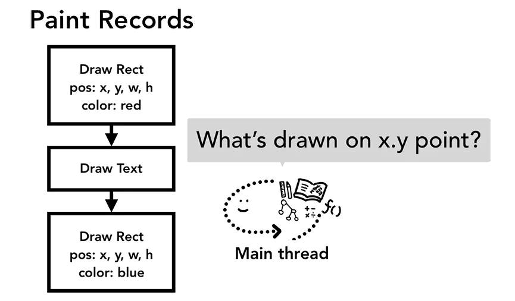

### 浏览器对事件的优化

一般我们屏幕的帧率是每秒60帧，也就是60fps，但是某些事件触发的频率超过了这个数值，比如wheel，mousewheel，mousemove，pointermove，touchmove，这些连续性的事件一般每秒会触发60~120次，假如每一次触发事件都将事件发送到主线程处理，由于屏幕的刷新速率相对来说降低，这样使得主线程会触发过量的命中测试以及JS代码，使得性能有了没必要是损耗。

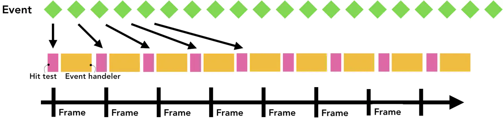

出于优化的目的，浏览器会合并这些连续的事件，延迟到下一帧渲染是执行，也就是`requestAnimationFrame`之前。

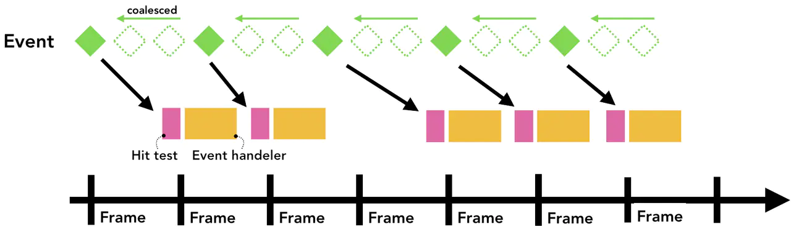

而对于非连续性的事件，如keydown，keyup，mousedown，mouseup，touchstart，touchend等，会直接派发给主线程去执行。

## 总结

浏览器的多进程架构，根据不同的功能划分了不同的进程，进程内不同的使命划分了不同的线程，当用户开始浏览网页时候，浏览器进程进行处理输入、开始导航请求数据、请求响应数据，查找新建渲染进程，提交导航，之后渲染又进行了解析HTML构建DOM、构建过程加载子资源、下载并执行JS代码、样式计算、布局、绘制、合成，一步一步的构建出一个可交互的WEB页面，之后浏览器进程又接受页面的交互事件信息，并将其交给渲染进程，渲染进程内主进程进行命中测试，查找目标元素并执行绑定的事件，完成页面的交互。

本文大部分内容也是对[inside look at modern web browser](https://developers.google.com/web/updates/2018/09/inside-browser-part1)系列文章的整理、解读和翻译吧，整理过程还是收获非常大的，希望读者读了本文只有有所启发吧。

## 相关参考链接

* [为什么浏览器会使用多进程架构](https://blog.csdn.net/ithzhang/article/details/7917754)
* [一文看懂Chrome浏览器工作原理](https://juejin.im/post/5e182a47e51d453cee48c752)
* [浏览器多进程架构](https://zhuanlan.zhihu.com/p/102128787)
* [图解浏览器的基本工作原理](https://zhuanlan.zhihu.com/p/47407398)
* [Inside look at modern web browser (part 2)](https://developers.google.com/web/updates/2018/09/inside-browser-part2)
* [Inside look at modern web browser (part 3)](https://developers.google.com/web/updates/2018/09/inside-browser-part3)


